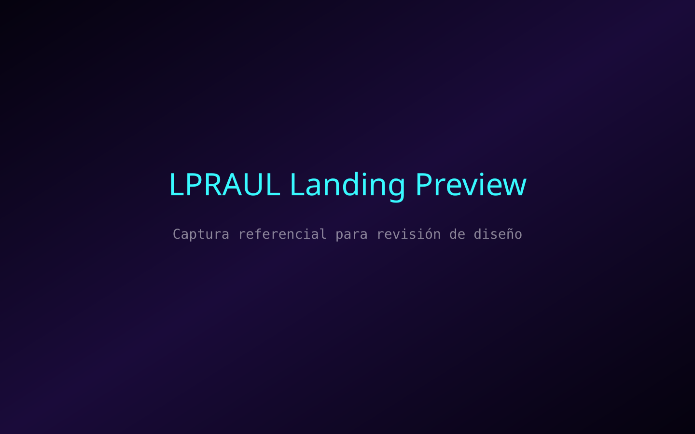

# LPRAUL Kitchen OS (Frontend)

Experiencia futurista construida con Next.js 14 (App Router) y TypeScript para operar pedidos gastronómicos omnicanal con estética neón + glassmorphism. Incluye componentes 3D reutilizables, búsqueda predictiva, simulación AR-ready y soporte PWA listo para despliegues en 2025.



## 🚀 Características clave

- **App Router + arquitectura modular**: layout con _sidebar_ persistente, proveedores globales para carrito y tema, y rutas dinámicas (`/menu`, `/cart`, `/orders`, `/profile`).
- **UI futurista**: Tailwind CSS configurado con gradientes neón, tarjetas holográficas, botones 3D y tipografías variables (`Orbitron`, `Space Grotesk`, `JetBrains Mono`).
- **Landing inmersiva**: canvas WebGL con animación shader + video superpuesto, badges de envío exprés y CTA rápidos.
- **Menú inteligente**: tabs de categorías, búsqueda predictiva, filtros AR/vegano/picante y tarjetas nutrimentales con badges AR-ready.
- **Carrito en tiempo real**: store basada en Context API con subtotal, pasos de checkout y `CheckoutDrawer` con tracking progresivo.
- **PWA & accesibilidad**: manifest + service worker para modo offline básico, focus management, etiquetas ARIA y controles accesibles.
- **Dark/light mode**: `ThemeProvider` propio con `ToggleSwitch` reutilizable y persistencia en `localStorage`.

## 🏗️ Estructura principal

```
frontend/
├── app/
│   ├── layout.tsx          # Shell con sidebar, proveedores globales y registro SW
│   ├── page.tsx            # Landing WebGL + CTA
│   ├── menu/page.tsx       # Buscador predictivo y filtros AR-ready
│   ├── cart/page.tsx       # Gestión de carrito y CheckoutDrawer
│   ├── orders/page.tsx     # Seguimiento de pedidos activos
│   └── profile/page.tsx    # Preferencias sensoriales y tema
├── components/
│   ├── landing/NeonCanvas.tsx      # Animación WebGL custom
│   ├── menu/*                     # Tabs, cards y badges nutricionales
│   ├── cart/CheckoutDrawer.tsx    # Drawer accesible con pasos de checkout
│   └── ui/*                       # Botones 3D, tarjetas holográficas, toggles, provider de tema
├── store/cartStore.ts      # Estado global del carrito y pedido
├── public/
│   ├── images/*.svg         # Mockups holográficos para los platos
│   ├── icons/*.svg          # Iconografía PWA (puede sustituirse por PNG en producción)
│   ├── sw.js                # Service worker offline-first básico
│   └── manifest.webmanifest # Metadatos PWA
└── tailwind.config.ts      # Paleta neon/glassmorphism + utilidades personalizadas
```

## 🧑‍💻 Desarrollo local

1. Instala dependencias (requiere acceso al registro npm):
   ```bash
   npm install
   ```
2. Ejecuta el entorno de desarrollo:
   ```bash
   npm run dev
   ```
3. Abre `http://localhost:3000` y prueba la navegación Sidebar + landing WebGL.

### Lint & formato

```bash
npm run lint
npm run format
```

> ℹ️ En entornos sin acceso a npm (como esta ejecución), la instalación de paquetes no es posible. Asegúrate de ejecutar los comandos anteriores en tu máquina local o dentro de un entorno con red para obtener las dependencias (`next`, `react`, `tailwindcss`, etc.).

## 📱 PWA y accesibilidad

- `public/manifest.webmanifest` define `start_url`, colores y íconos (SVG). Sustituye por PNG si tu tienda requiere compatibilidad estricta.
- `public/sw.js` implementa _cache-first_ simple para navegación offline.
- `ThemeToggle`, `ToggleSwitch` y `Button3D` aplican `focus-ring-neon` y anuncios `aria-live` en estados críticos.
- Para auditoría Lighthouse:
  ```bash
  npm run dev
  # abre Chrome -> Lighthouse -> Progressive Web App + Accessibility
  ```

## ☁️ Despliegue en Vercel

1. Desde la raíz del repo:
   ```bash
   vercel login
   vercel
   ```
2. Configura las variables de entorno necesarias (si aplica) desde el panel de Vercel.
3. Habilita la opción **"Install Command"** en blanco (Vercel detectará `npm install`) y **"Build Command"**: `npm run build`.
4. Define `OUTPUT` como `Next.js App` (auto-detectado) y confirma el dominio.

## 🖼️ Capturas de pantalla

- `public/screenshots/landing-preview.svg` actúa como mockup base. Sustituye con capturas reales una vez desplegado (`npm run dev` + `⌘⇧4` o herramienta equivalente).
- Documenta capturas adicionales en este apartado para revisión de stakeholders (por ejemplo, `/public/screenshots/menu-ar.png`).

## ✅ Checklist de calidad

- [x] App Router + TypeScript
- [x] Tailwind personalizado (neón/glass) y componentes reutilizables
- [x] Landing WebGL con CTA expresos y badges
- [x] Menú con búsqueda predictiva + filtros AR-ready
- [x] Carrito + CheckoutDrawer con estado en tiempo real
- [x] PWA (manifest + service worker) y foco accesible
- [x] Documentación con despliegue Vercel y capturas base

> 💡 Siguiente paso sugerido: integrar APIs reales (inventario, pagos) y persistencia remota para sincronizar el estado del carrito entre dispositivos.
